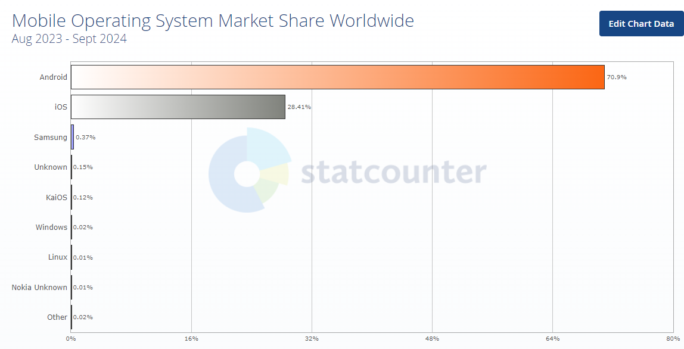
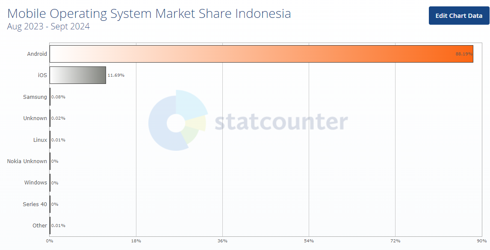
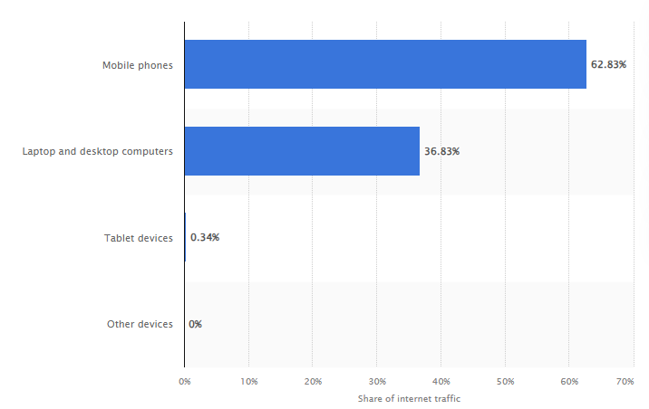

<!-- 
_class: lead 
_paginate: skip
-->

# Pengantar Pemrograman Mobile

---

## Evolusi Teknologi Mobile

- **Sistem Operasi Awal (1990-an)**
    Palm OS, Windows CE
- **Sistem Operasi Berbasis Java (2000-an)**
    Java ME (Micro Edition)
- **Era Smartphone (2007 - 2010)**
    iOS, Android
- **Sistem Operasi Baru (2010-an)**
    Windows Phone, BlackBerry OS
- **Perkembangan dan Inovasi (2015 - Sekarang)**
    Android, iOS

---

## Mobile OS Market Share Worldwide

<!-- _footer: https://gs.statcounter.com/os-market-share/mobile/worldwide -->

---

## Mobile OS Market Share in Indonesia

<!-- 
_footer: https://gs.statcounter.com/os-market-share/mobile/indonesia/#monthly-202308-202409-bar -->

---

## Pengguna Internet

<!-- _footer: https://tekno.kompas.com/read/2022/05/09/19300027/lebih-dari-90-persen-warganet-indonesia-mengakses-internet-lewat-ponsel -->

---

## Distribution of web traffic

<!-- _footer: https://www.statista.com/statistics/1362949/indonesia-share-of-web-traffic-by-device/#:~:text=As%20of%20December%202023%2C%20around,and%20desktop%20computers%20that%20year. -->

---

## Jenis-Jenis Aplikasi Mobile

--- 

## Native Apps

Aplikasi yang dikembangkan khusus untuk satu platform (Android atau iOS) menggunakan bahasa pemrograman dan alat yang sesuai.

Contoh:
Android: WhatsApp (dengan Kotlin atau Java)
iOS: Instagram (dengan Swift)

--- 

## Hybrid Apps

Aplikasi yang menggabungkan elemen dari native dan web apps. Mereka ditulis dengan menggunakan teknologi web (HTML, CSS, JavaScript) dan di dalam "wrapper" native, memungkinkan mereka diinstal dan berjalan di perangkat mobile.

Contoh:
Ionic: Framework untuk mengembangkan aplikasi hybrid seperti MarketWatch.

---

## Cross-Platform Apps

Aplikasi yang ditulis menggunakan framework yang memungkinkan kode yang sama untuk dijalankan di berbagai platform (Android dan iOS).

Contoh:
React Native: Framework yang digunakan untuk membuat aplikasi seperti Facebook dan Airbnb.

---

## Perbandingan Bahasa

| **Aspek**                | **Native App**                                                                             | **Hybrid App**                                                                          | **Cross-Platform App**                                                                                              |
| ------------------------ | ------------------------------------------------------------------------------------------ | --------------------------------------------------------------------------------------- | ------------------------------------------------------------------------------------------------------------------- |
| **Bahasa Pemrograman** | Kotlin, Swift                                | HTML, CSS, JavaScript                      | JavaScript (React Native) Flutter        |

---

## Perbandingan Performa

| **Aspek**                | **Native App**                                                                             | **Hybrid App**                                                                          | **Cross-Platform App**                                                                                              |
| ------------------------ | ------------------------------------------------------------------------------------------ | --------------------------------------------------------------------------------------- | ------------------------------------------------------------------------------------------------------------------- |
| **Performa**             | Sangat baik dan responsif                                                                  | Baik, tetapi tidak sebaik native apps                                                   | Dekat dengan native, tergantung implementasi                                                                        |

---

## Perbandingan Akses Fitur Hardware

| **Aspek**                | **Native App**                                                                             | **Hybrid App**                                                                          | **Cross-Platform App**                                                                                              |
| ------------------------ | ------------------------------------------------------------------------------------------ | --------------------------------------------------------------------------------------- | ------------------------------------------------------------------------------------------------------------------- |
| **Akses Fitur Hardware** | Lengkap (kamera, GPS, dll.)                                                                | Terbatas, dapat mengakses beberapa fitur hardware                                       | Cukup baik, bisa mengakses banyak fitur hardware                                                                    |

---

## Perbandingan Waktu Pengembangan

| **Aspek**                | **Native App**                                                                             | **Hybrid App**                                                                          | **Cross-Platform App**                                                                                              |
| ------------------------ | ------------------------------------------------------------------------------------------ | --------------------------------------------------------------------------------------- | ------------------------------------------------------------------------------------------------------------------- |
| **Waktu Pengembangan**   | Lebih lama karena pengembangan terpisah untuk setiap platform                              | Sedang, antara native dan web app                                                       | Sedang, tetapi lebih efisien dibandingkan native                                                                    |

---

## Perbandingan Pemeliharan

| **Aspek**                | **Native App**                                                                             | **Hybrid App**                                                                          | **Cross-Platform App**                                                                                              |
| ------------------------ | ------------------------------------------------------------------------------------------ | --------------------------------------------------------------------------------------- | ------------------------------------------------------------------------------------------------------------------- |
| **Pemeliharaan**         | Memerlukan pemeliharaan terpisah untuk setiap platform                                     | Memerlukan pemeliharaan untuk wrapper dan web                                           | Memerlukan pemeliharaan kode untuk semua platform                                                                   |

---

## Perbandingan Kelebihan

| **Aspek**                | **Native App**                                                                             | **Hybrid App**                                                                          | **Cross-Platform App**                                                                                              |
| ------------------------ | ------------------------------------------------------------------------------------------ | --------------------------------------------------------------------------------------- | ------------------------------------------------------------------------------------------------------------------- |
| **Kelebihan**            | - Performa terbaik   - Akses penuh ke fitur perangkat                                   | - Pengembangan lebih cepat   - Satu kode untuk semua platform                        | - Satu kode untuk beberapa platform   - Lebih cepat dari native                                                  |

---

## Perbandingan Kekurangan

| **Aspek**                | **Native App**                                                                             | **Hybrid App**                                                                          | **Cross-Platform App**                                                                                              |
| ------------------------ | ------------------------------------------------------------------------------------------ | --------------------------------------------------------------------------------------- | ------------------------------------------------------------------------------------------------------------------- |
| **Kekurangan**           | - Memerlukan dua pengembangan terpisah   - Biaya lebih tinggi                           | - Kinerja tidak seoptimal native   - Akses fitur terbatas                            | - Mungkin tidak seoptimal native   - Ketergantungan pada framework                                               |

---

## Apa itu React Native?

React Native adalah framework open-source yang dibuat oleh Facebook, memungkinkan pengembang membangun aplikasi mobile menggunakan JavaScript dan React. Ini memungkinkan kode yang sama untuk digunakan di Android dan iOS, 

---

## Arsitektur React Native

- JavaScript Core adalah mesin yang menjalankan aplikasi React Native di Android dan iOS.
- Bridge adalah jembatan komunikasi antara kode JavaScript dan native components.
- Component-Based Architecture: React Native menggunakan komponen yang dapat digunakan kembali (reusable components) seperti View, Text, dan Button.

