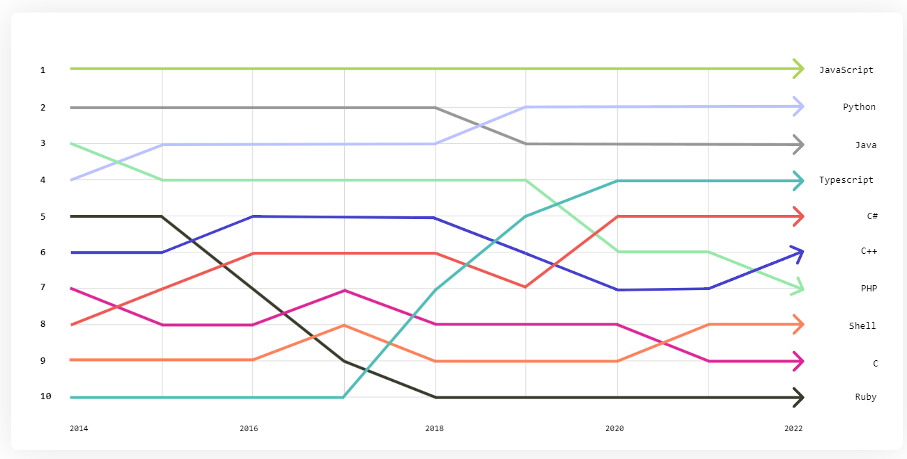

<!-- 
_class: lead 
_paginate: skip
-->

# Javascript

---

## Sejarah Singkat JavaScript

- Diciptakan oleh Brendan Eich pada tahun 1995 di Netscape.
- Awalnya disebut "Mocha," kemudian berubah menjadi "LiveScript," dan akhirnya "JavaScript."
- Tujuan utama awal : membuat halaman web interaktif di browser.

---

## Pengertian JavaScript

- Salah satu Bahasa pemrograman tingkat tinggi.
- Beroperasi pada sisi client (client-side), namun dapat digunakan juga pada sisi server (server-side) dengan teknologi seperti Node.js.

---

## JavaScript dalam Pengembangan Modern

- JavaScript di Front-End:
    - Framework dan Library: React, Vue.js, Angular.
    - Penerapan SPA (Single Page Application).
- JavaScript di Back-End:
    - Node.js untuk membuat aplikasi server-side.
- Tools Modern:
    - Package Manager: npm, yarn.
    - Task Runner dan Bundler: Webpack, Gulp, Babel.

---

## Versi Javascript

JavaScript memiliki berbagai versi yang secara resmi diadopsi melalui standar ECMAScript (ES).
- ECMAScript 1 (ES1) - 1997
- ...
- ECMAScript 6 (ES6 / ES2015) - 2015
- ...
- ECMAScript 14 (ES14 / ES2023) - 2023

---

## Top programming language



source : https://octoverse.github.com/2022/top-programming-languages

---

<!-- 
_class: lead 
_paginate: skip
-->

## Javascript Refresh

---

## let dan const
- _let_ dan _const_ adalah cara mendeklarasikan variabel di JavaScript. Keduanya diperkenalkan di ES6 sebagai pengganti var yang memiliki cakupan (scope) yang kurang jelas.
- _let_: Digunakan untuk variabel yang nilainya dapat berubah (mutable).
- _const_: Digunakan untuk variabel yang nilainya tidak dapat diubah (immutable), namun objek atau array yang dideklarasikan dengan _const_ masih bisa dimodifikasi.

---

```js
let age = 25;      // nilai 'age' bisa diubah
age = 26;

const name = "John";  // nilai 'name' tidak bisa diubah
name = "Doe";        // Error: Assignment to constant variable.
```

---

## Functions

Fungsi adalah blok kode yang dapat dieksekusi ketika dipanggil. Fungsi dapat menerima parameter dan mengembalikan nilai.

```js
function greet(name) {
  return `Hello, ${name}!`;
}

console.log(greet("Alice"));  // Output: Hello, Alice!
```

---

## Arrow Functions

Arrow functions adalah sintaks baru untuk mendefinisikan fungsi yang lebih ringkas. Arrow functions juga tidak memiliki this sendiri dan mengikat this dari lingkup terluarnya.

```js
const greet = (name) => `Hello, ${name}!`;

console.log(greet("Alice"));  // Output: Hello, Alice!
```

---

## Objects: Properties and Methods

- Objek di JavaScript adalah koleksi dari properti dan metode (fungsi dalam objek).
- Properti adalah pasangan key-value yang menyimpan data.
- Metode adalah fungsi yang merupakan properti objek

---

```js
const person = {
  name: "John",
  age: 30,
  greet() {
    console.log(`Hello, my name is ${this.name}.`);
  }
};

console.log(person.name);   // Output: John
person.greet();             // Output: Hello, my name is John.
```

---

## Array and Array Methods

- Array adalah struktur data yang menyimpan beberapa nilai dalam satu variabel.
- JavaScript menyediakan berbagai metode untuk memanipulasi array seperti map(), filter(), reduce(), forEach(), dll.

```js
const numbers = [1, 2, 3, 4, 5];
const doubled = numbers.map(num => num * 2);  // Menggandakan setiap elemen
console.log(doubled);  // Output: [2, 4, 6, 8, 10]
```

---

## Array, Object, and Reference Types

- Array dan objek adalah reference types, yang berarti mereka disimpan dalam memori berdasarkan referensi, bukan berdasarkan nilainya.
- Ketika Anda mengubah sebuah array atau objek yang dikopi melalui referensi, perubahan akan berlaku pada variabel asli.

---

```js
const arr1 = [1, 2, 3];
const arr2 = arr1;
arr2.push(4);
console.log(arr1);  // Output: [1, 2, 3, 4] (arr1 juga berubah)

const obj1 = { name: "Alice" };
const obj2 = obj1;
obj2.name = "Bob";
console.log(obj1.name);  // Output: Bob (obj1 juga berubah)
```

---

## Spread Operator dan Rest Parameters

- Spread operator (...) digunakan untuk menyalin atau menggabungkan array atau objek, serta menyebarkan elemen array ke dalam elemen terpisah.
- Rest parameters (...) digunakan dalam definisi fungsi untuk menerima jumlah argumen yang tidak terbatas sebagai array.

---

```js
// Spread Operator
const arr1 = [1, 2, 3];
const arr2 = [...arr1, 4, 5];
console.log(arr2);  // Output: [1, 2, 3, 4, 5]

// Rest Parameters
function sum(...numbers) {
  return numbers.reduce((acc, num) => acc + num, 0);
}
console.log(sum(1, 2, 3, 4));  // Output: 10
```

---

## Destructuring

Destructuring adalah sintaks yang memungkinkan kita mengekstrak nilai dari array atau properti dari objek ke dalam variabel yang lebih sederhana.

```js
// Destructuring Array
const numbers = [1, 2, 3];
const [a, b, c] = numbers;
console.log(a, b, c);  // Output: 1 2 3

// Destructuring Object
const person = { name: "John", age: 30 };
const { name, age } = person;
console.log(name, age);  // Output: John 30
```

---

## Async Code and Promises

- Asynchronous code adalah kode yang tidak langsung dijalankan tetapi ditunda hingga event tertentu selesai, seperti permintaan jaringan.
- Promises digunakan untuk menangani operasi asynchronous di mana ada kemungkinan operasi berhasil atau gagal. Promise memiliki tiga status: pending, resolved, dan rejected.

---

```js
// Menggunakan Promise
const fetchData = () => {
  return new Promise((resolve, reject) => {
    setTimeout(() => {
      resolve("Data fetched");
    }, 2000);
  });
};

fetchData().then(data => {
  console.log(data);  // Output setelah 2 detik: Data fetched
}).catch(err => {
  console.error(err);
});
```

---

```js
async function fetchData() {
  try {
    const data = await new Promise((resolve) => {
      setTimeout(() => resolve("Data fetched"), 2000);
    });
    console.log(data);  // Output setelah 2 detik: Data fetched
  } catch (error) {
    console.error(error);
  }
}

fetchData();
```

