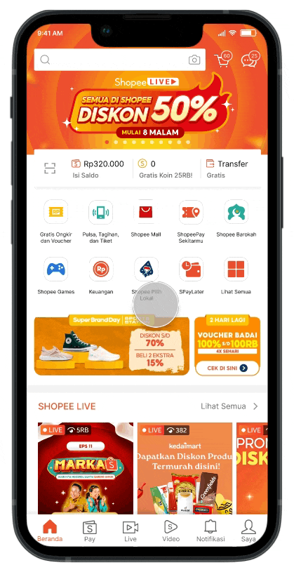

<!-- 
_class: lead 
_paginate: skip
-->

# Tahapan Pengembangan Aplikasi Mobile

---

> use case Shoppe
---

<!-- _class: lead
_paginate: skip -->

# Konseptualisasi dan Riset

---

## Identifikasi ide dan target pengguna

Pahami tujuan aplikasi dan siapa yang akan menggunakannya.

---

> _Shopee_ bertujuan untuk menjadi platform e-commerce terkemuka di Asia Tenggara, dengan fokus pada pengguna mobile. Target pengguna _Shopee_ adalah masyarakat luas yang mencari pengalaman belanja online yang mudah, cepat, dan terjangkau.

---

## Riset pasar

Pelajari pesaing, identifikasi peluang, dan kumpulkan wawasan tentang ekspektasi pengguna serta fitur potensial dari aplikasi.

---

> _Shopee_ mempelajari pesaing seperti Lazada dan Tokopedia, menemukan bahwa fitur gamifikasi dan promosi menarik dapat meningkatkan keterlibatan pengguna. Mereka juga mengidentifikasi peluang untuk menawarkan metode pembayaran yang fleksibel seperti _Shopee_Pay dan fitur Cash on Delivery (COD) untuk mengakomodasi preferensi pasar lokal.

---

## Tetapkan tujuan aplikasi

Tentukan apa yang perlu dicapai oleh aplikasi dan bagaimana aplikasi ini akan memberikan manfaat bagi pengguna.

---

> Tujuan _Shopee_ adalah menciptakan aplikasi yang mudah digunakan dengan fitur unggulan seperti Flash Sale, Live Streaming, dan pengiriman cepat. Aplikasi ini dirancang untuk memenuhi kebutuhan pengguna di berbagai lapisan masyarakat dengan akses produk yang luas, diskon, dan pengalaman belanja yang interaktif.

---

<!-- _class: lead
_paginate: skip -->

# Perencanaan

---

## Buat roadmap

Gambarkan proses pengembangan, termasuk garis waktu proyek, tonggak-tonggak penting, dan hasil utama.

---

---

> _Shopee_ mengembangkan roadmap pengembangan aplikasi dengan fase-fase penting seperti pengenalan fitur dasar (pencarian produk, checkout), integrasi sistem pembayaran (Shopee Pay), dan kemudian penambahan fitur gamifikasi seperti _Shopee_ Games. Mereka juga menentukan jadwal peluncuran regional di berbagai negara, dimulai dari Singapura lalu diperluas ke negara-negara lain di Asia Tenggara.

---

## Pilih teknologi yang akan digunakan

Tentukan platform (iOS, Android, atau keduanya), framework (misalnya React Native, Flutter), dan alat bantu pengembangan.

---

> _Shopee_ memilih untuk menggunakan teknologi React Native agar dapat mengembangkan aplikasi untuk iOS dan Android secara bersamaan, mempercepat proses pengembangan. Mereka juga memanfaatkan alat bantu seperti Firebase untuk push notifications dan Google Analytics untuk analitik pengguna.

---

## Desain wireframe dan user journey

Buat sketsa tata letak aplikasi dan definisikan alur aplikasi berdasarkan perjalanan pengguna melalui fitur-fitur yang tersedia.

---

<!-- _footer: https://medium.com/@mariamerry18/ui-ux-case-study-research-ui-ux-pada-aplikasi-shopee-food-913437648123 -->

---

> _Shopee_ mendesain wireframe yang menekankan pada kemudahan navigasi, dari halaman utama yang menampilkan kategori produk dan promo, hingga checkout yang intuitif. Alur pengguna dirancang agar pengguna dapat dengan mudah menemukan produk, menambahkannya ke keranjang, dan menyelesaikan pembelian dengan beberapa klik saja.

---

<!-- _class: lead
_paginate: skip -->

# Desain UI/UX

---

## Desain Pengalaman Pengguna (UX)

Fokus pada fungsionalitas dan kemudahan penggunaan aplikasi. Rancang navigasi yang mudah dan interaksi yang nyaman bagi pengguna.

---

> _Shopee_ fokus pada kenyamanan pengguna dengan tata letak sederhana, misalnya fitur pencarian yang selalu terlihat, ikon kategori yang mudah dikenali, dan proses checkout yang cepat. Interaksi didesain agar pengguna dapat dengan mudah menemukan produk diskon atau ikut dalam Flash Sale tanpa kebingungan.

---

## Desain Antarmuka Pengguna (UI)

Kembangkan komponen visual, termasuk skema warna, tipografi, dan ikonografi untuk menciptakan desain yang menarik dan mudah digunakan.

---

<!-- _footer: https://medium.com/@yunifasafariyani/_shopee_-cart-improvement-ui-ux-case-study-43b56a1c0d38 -->

---

> _Shopee_ menggunakan skema warna cerah, ikon yang mudah dipahami, dan tipografi yang jelas. Misalnya, warna oranye dan hijau digunakan untuk menarik perhatian pada promosi besar dan tombol pembayaran, memastikan pengguna fokus pada area penting.

---

## Prototyping

Buat prototipe interaktif untuk mensimulasikan tampilan dan nuansa aplikasi.

---

<!-- _footer: https://medium.com/@yunifasafariyani/_shopee_-cart-improvement-ui-ux-case-study-43b56a1c0d38 
-->

---

> _Shopee_ membuat prototipe interaktif untuk mensimulasikan alur Flash Sale, di mana pengguna dapat mencoba bagaimana produk akan muncul secara cepat dan bagaimana pengalaman pengguna selama pembelian dalam waktu singkat. Prototipe ini membantu mengidentifikasi masalah navigasi sebelum diluncurkan.

---

<!-- _class: lead
_paginate: skip -->

# Pengembangan

---

## Pengembangan Frontend

Implementasikan antarmuka pengguna dan komponen visual aplikasi (seperti tombol, tata letak). Untuk aplikasi lintas platform, framework seperti React Native atau Flutter sering digunakan.

---

> _Shopee_ mengembangkan tampilan aplikasi dengan menggunakan React Native, membuat antarmuka yang adaptif di perangkat Android dan iOS. Mereka memastikan komponen visual seperti tombol promo Flash Sale dan banner _Shopee_ Mall terlihat konsisten di semua perangkat.

---

## Pengembangan Backend

Bangun logika server-side, basis data, dan API yang mendukung fungsionalitas aplikasi (jika aplikasi membutuhkan penyimpanan data jarak jauh atau akun pengguna).

---

> _Shopee_ membangun logika server-side untuk menangani jutaan transaksi per hari, memastikan sistem backend mampu menangani skala besar dan lonjakan lalu lintas saat Flash Sale. Mereka juga menggunakan basis data yang dapat diskalakan dan layanan API untuk menyediakan data produk dan informasi pengguna secara real-time.

---

## Integrasi API dan Layanan Eksternal

Integrasikan layanan pihak ketiga seperti gateway pembayaran, platform media sosial, dan alat analitik jika diperlukan.

---

> _Shopee_ mengintegrasikan berbagai layanan pihak ketiga, seperti gateway pembayaran lokal, platform media sosial untuk login (Facebook, Google), serta alat analitik seperti Google Analytics untuk melacak perilaku pengguna dan Firebase untuk mengelola notifikasi push.

---

## Fitur Khusus Mobile

Implementasikan fitur seperti notifikasi push, integrasi kamera, dan layanan geolokasi.

---

> _Shopee_ mengimplementasikan notifikasi push yang memberitahukan pengguna tentang promo terbaru, integrasi kamera untuk fitur scan produk, dan layanan geolokasi untuk pengiriman yang lebih akurat.

---

<!-- _class: lead
_paginate: skip -->

# Pengujian

---

## Pengujian Fungsional

Pastikan fitur-fitur aplikasi berfungsi sesuai dengan yang diharapkan di berbagai perangkat, platform, dan sistem operasi.

---

> _Shopee_ melakukan pengujian pada berbagai perangkat Android dan iOS untuk memastikan semua fitur (pencarian, filter produk, checkout, dll.) berfungsi dengan baik di semua sistem operasi dan ukuran layar yang berbeda.

---

## Pengujian Performa

Uji performa aplikasi dalam hal kecepatan, responsivitas, dan penggunaan sumber daya.

---

> Mereka melakukan stress testing selama Flash Sale untuk memastikan server dapat menangani lonjakan pengguna yang tinggi tanpa crash atau perlambatan. Pengujian juga dilakukan untuk memastikan aplikasi tetap responsif meskipun banyak pengguna aktif secara bersamaan.

---

## Pengujian Usability

Nilai kemudahan penggunaan dari sudut pandang pengguna dan identifikasi area yang perlu diperbaiki.

---

> _Shopee_ melibatkan pengguna dalam usability testing untuk memastikan alur belanja mudah diikuti. Umpan balik pengguna digunakan untuk memperbaiki tata letak dan membuat fitur-fitur lebih mudah diakses, seperti penempatan tombol checkout yang strategis.

---

## Pengujian Keamanan

Periksa kerentanan seperti kebocoran data dan pastikan data pengguna terlindungi.

---

>  _Shopee_ melakukan security testing untuk melindungi data pengguna, seperti informasi pembayaran, dari potensi kebocoran. Mereka juga memastikan bahwa transaksi melalui _Shopee_Pay atau kartu kredit terenkripsi dengan aman.

---

<!-- _class: lead
_paginate: skip -->

# Peluncuran

---

## Pengunggahan ke App Store

Persiapkan aplikasi untuk dirilis dengan mematuhi pedoman dari toko aplikasi (Apple App Store untuk iOS dan Google Play Store untuk Android).

---

> _Shopee_ memastikan aplikasinya memenuhi semua persyaratan dari Apple App Store dan Google Play Store, termasuk kebijakan privasi dan penjelasan fitur yang lengkap. Setelah siap, aplikasi diunggah ke kedua platform untuk diunduh oleh publik.

---

## Beta Testing/Soft Launch

Opsional, rilis versi beta kepada audiens kecil untuk mendapatkan umpan balik sebelum peluncuran penuh.

---

> Sebelum peluncuran besar-besaran, _Shopee_ melakukan soft launch di beberapa negara untuk menguji performa dan mendapatkan umpan balik pengguna awal, memungkinkan mereka memperbaiki bug sebelum peluncuran global.

---

## Persetujuan

Toko aplikasi akan meninjau aplikasi Anda dan menyetujuinya untuk dirilis secara publik atau meminta modifikasi.

---

> Setelah peninjauan dari toko aplikasi, _Shopee_ berhasil merilis aplikasinya secara publik dan menerima persetujuan untuk digunakan di berbagai negara.

---

<!-- _class: lead
_paginate: skip -->

# Pemeliharaan Pasca-Peluncuran

---

## Perbaikan Bug

Pantau umpan balik pengguna dan perbaiki bug yang muncul setelah peluncuran.

---

> Setelah peluncuran, _Shopee_ terus memantau umpan balik pengguna melalui review di app store dan laporan bug. Mereka secara berkala merilis perbaikan untuk masalah yang dilaporkan.

--- 

## Peningkatan Performa

Terus tingkatkan aplikasi berdasarkan umpan balik pengguna dan kemajuan teknologi baru.

---

> _Shopee_ mengoptimalkan kinerja aplikasi berdasarkan teknologi terbaru, seperti mempercepat waktu loading halaman dan mengurangi penggunaan memori pada perangkat lama.

---

## Pembaruan dan Fitur Baru

Secara rutin rilis pembaruan dengan fitur baru, peningkatan performa, dan perbaikan desain.

---

> _Shopee_ secara rutin menambahkan fitur-fitur baru seperti _Shopee_ Live (streaming untuk penjual), peningkatan pada _Shopee_Pay, serta fitur diskon otomatis pada checkout. Pembaruan ini membantu aplikasi tetap kompetitif.

---

## Pemasaran dan Akuisisi Pengguna

Promosikan aplikasi melalui pemasaran digital, promosi dalam aplikasi, dan strategi keterlibatan pengguna untuk memperluas basis pengguna.

---

> _Shopee_ menggunakan strategi pemasaran digital yang kuat, seperti promosi dalam aplikasi, kolaborasi dengan selebriti, dan kampanye media sosial untuk menarik pengguna baru dan meningkatkan engagement di platform mereka.