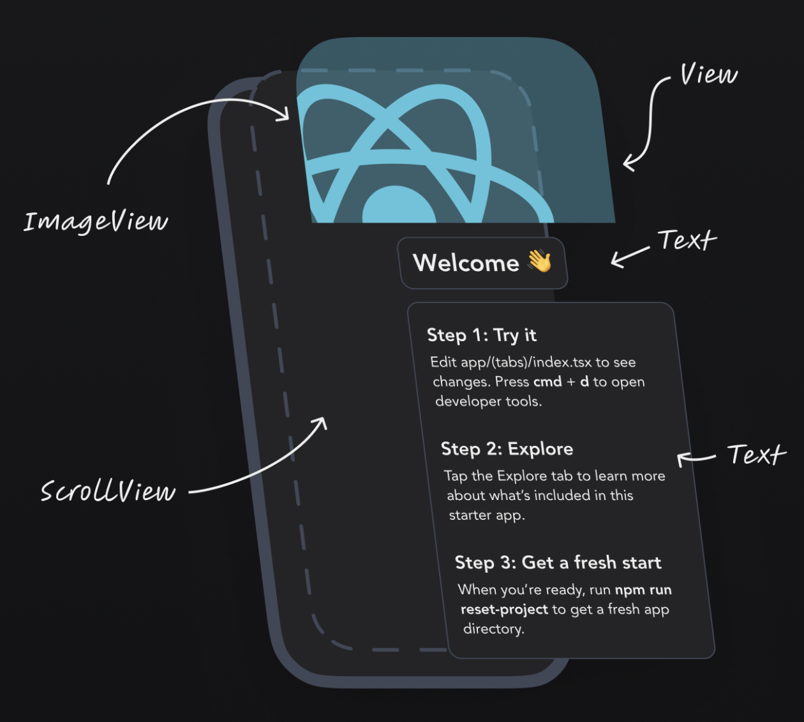

<!-- 
_class: lead 
_paginate: skip
-->

# React Native Component

---

## Apa itu Komponen di React Native

Komponen adalah blok penyusun utama dalam aplikasi React Native. Setiap bagian dari UI dibagi menjadi komponen-komponen kecil.

Komponen memungkinkan developer membuat UI yang reusable.

---


```javascript
import React from 'react';
import { Text, View } from 'react-native';

const HelloWorld = () => {
  return (
    <View>
      <Text>Hello, World!</Text>
    </View>
  );
};

export default HelloWorld;
```

---

## Apa itu JSX

JSX (JavaScript XML) adalah sintaks khusus yang digunakan dalam React dan React Native untuk mendeskripsikan elemen UI. JSX memungkinkan penulisan elemen dengan cara yang mirip dengan HTML di dalam JavaScript,

---

## Basic Components

- `View`: Kontainer untuk menampung komponen lain.
- `Text`: Digunakan untuk menampilkan teks.
- `Image`: Digunakan untuk menampilkan gambar.
- `ScrollView`: Kontainer yang bisa di-scroll.
- `TextInput`: Input teks.
- `Button`: Untuk menambahkan tombol.

---



---

##  Properti (Props) pada Komponen

Props (properties) adalah parameter yang diteruskan ke komponen untuk menyesuaikan tampilan atau perilaku komponen tersebut. Props bersifat immutable (tidak bisa diubah oleh komponen itu sendiri).

```js
<View>
  <Text style={{ color: 'blue', fontSize: 20 }}>Hello, World!</Text>
</View>
```
---

<!-- 
_class: lead 
_paginate: skip
-->

## View

---

## Apa Itu Komponen View?

Komponen View adalah komponen dasar dalam React Native yang berfungsi sebagai kontainer untuk menyusun elemen UI lainnya.

View digunakan untuk membuat layout, membungkus komponen, dan menerapkan styling pada grup elemen.

---

## Membuat Komponen View

```js
import React from 'react';
import { View, Text } from 'react-native';

const App = () => {
  return (
    <View>
    </View>
  );
};

export default App;
```

---

<!-- 
_class: lead 
_paginate: skip
-->

## Text

---

## Apa Itu Komponen Text?

- Komponen Text adalah komponen dasar dalam React Native yang digunakan untuk menampilkan teks dalam antarmuka pengguna.
- Komponen ini mendukung berbagai styling dan dapat digunakan di dalam komponen lain seperti View.

---

```js
import React from 'react';
import { Text, View } from 'react-native';

const App = () => {
  return (
    <View>
      <Text>Hello, World!</Text>
    </View>
  );
};

export default App;
```

---

## Menambahkan Teks Dinamis

Anda dapat menambahkan teks dinamis dengan menyisipkan variabel JavaScript ke dalam komponen Text menggunakan kurung kurawal {}.

```js
const App = () => {
  const name = 'John';
  
  return (
    <View>
      <Text>Hello, {name}!</Text>
    </View>
  );
};
```

---

<!-- 
_class: lead 
_paginate: skip
-->

## Image

---

## Apa Itu Komponen Image?

- Komponen Image di React Native digunakan untuk menampilkan gambar dari berbagai sumber, seperti file lokal, URL, atau dari cache gambar di aplikasi.
- Image adalah komponen utama untuk menampilkan elemen visual di aplikasi seluler.

---

## Menggunakan Komponen Image

Untuk menggunakan komponen Image, Anda perlu mengimpornya dari react-native dan memberikan properti source untuk mengatur sumber gambar.

```js
import React from 'react';
import { Image, View } from 'react-native';

const App = () => {
  return (
    <View>
      <Image source={{ uri: 'https://example.com/myimage.jpg' }} style={{ width: 200, height: 200 }} />
    </View>
  );
};

export default App;
```

---

## Menampilkan Gambar Lokal

Anda bisa menampilkan gambar lokal yang ada di proyek dengan menggunakan require() untuk mengimpor gambar.

```js
const App = () => {
  return (
    <View>
      <Image source={require('./assets/myimage.png')} style={{ width: 200, height: 200 }} />
    </View>
  );
};
```

---

## Properti pada Komponen Image

Komponen Image mendukung beberapa properti untuk mengatur tampilannya, di antaranya:

- source: Sumber gambar, bisa dari URI atau require().
- resizeMode: Mengatur bagaimana gambar diubah ukurannya agar sesuai dengan tampilan. 
  
---

## Nilai `resizeMode` yang didukung meliputi:

- `cover`: Gambar memenuhi seluruh area sambil mempertahankan rasio aspek.
- `contain`: Gambar akan sepenuhnya ditampilkan tanpa dipotong.
- `stretch`: Gambar akan ditarik untuk mengisi dimensi yang diberikan.
- `repeat`: Gambar akan diulang.
- `center`: Gambar ditempatkan di tengah tanpa diubah ukurannya.

---

<!-- 
_class: lead 
_paginate: skip
-->

## TextInput

---

## Apa Itu TextInput?

- TextInput adalah komponen di React Native yang digunakan untuk menerima input teks dari pengguna.
- Komponen ini sering digunakan dalam formulir, pencarian, dan fitur yang membutuhkan interaksi dengan pengguna untuk memasukkan teks.
- TextInput mendukung berbagai fitur seperti placeholder, gaya, kontrol panjang teks, dan pengelolaan input secara real-time.

---

##  Cara Menggunakan TextInput

Untuk menggunakan TextInput, Anda harus mengimpornya dari react-native dan menggunakannya di dalam komponen Anda.

---

```js
import React, { useState } from 'react';
import { TextInput, View } from 'react-native';

const App = () => {

  return (
    <View>
      <TextInput 
        style={{ height: 40, borderColor: 'gray', borderWidth: 1 }}
        placeholder="Enter text"
      />
    </View>
  );
};

export default App;

```