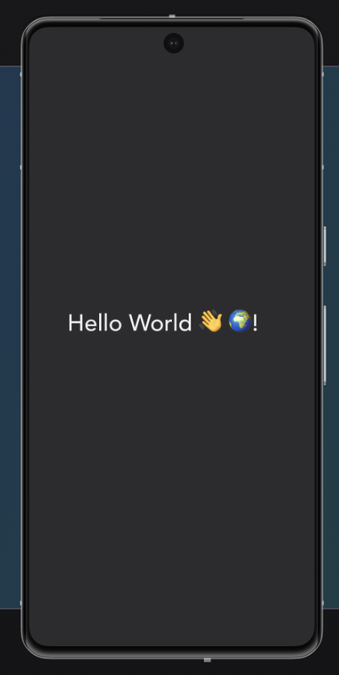

<!-- 
_class: lead 
_paginate: skip
-->

# React Native Component

---

## 1. Apa itu Komponen di React Native

Komponen adalah blok penyusun utama dalam aplikasi React Native. Setiap bagian dari UI dibagi menjadi komponen-komponen kecil.

Komponen memungkinkan developer membuat UI yang reusable.

---



```javascript
import React from 'react';
import { Text, View } from 'react-native';

const HelloWorld = () => {
  return (
    <View>
      <Text>Hello, World!</Text>
    </View>
  );
};

export default HelloWorld;
```

---

## Apa itu JSX

JSX (JavaScript XML) adalah sintaks khusus yang digunakan dalam React dan React Native untuk mendeskripsikan elemen UI. JSX memungkinkan penulisan elemen dengan cara yang mirip dengan HTML di dalam JavaScript,

---

## 2. Pengenalan Komponen Built-in di React Native

- `View`: Kontainer untuk menampung komponen lain.
- `Text`: Digunakan untuk menampilkan teks.
- `Image`: Digunakan untuk menampilkan gambar.
- `ScrollView`: Kontainer yang bisa di-scroll.
- `TextInput`: Input teks.
- `Button`: Untuk menambahkan tombol.

---


---

## 3. Properti (Props) pada Komponen

Props (properties) adalah parameter yang diteruskan ke komponen untuk menyesuaikan tampilan atau perilaku komponen tersebut. Props bersifat immutable (tidak bisa diubah oleh komponen itu sendiri).

---

```javascript
const WelcomeMessage = (props) => {
  return <Text>Welcome, {props.name}!</Text>;
};

const App = () => {
  return <WelcomeMessage name="John" />;
};
```

---


## 7. Styling Komponen

Styling di React Native dilakukan menggunakan objek JavaScript dengan properti CSS yang sudah disesuaikan untuk React Native. React Native menggunakan Flexbox untuk pengaturan tata letak.

---

```javascript
import React from 'react';
import { View, Text, StyleSheet } from 'react-native';

const StyledComponent = () => {
  return (
    <View style={styles.container}>
      <Text style={styles.text}>Styled Text</Text>
    </View>
  );
};

const styles = StyleSheet.create({
  container: {
    padding: 20,
    backgroundColor: 'lightblue',
    alignItems: 'center'
  },
  text: {
    fontSize: 18,
    color: 'white',
  },
});

export default StyledComponent;
```

---

## 8. Komponen List (FlatList dan SectionList)

Untuk menampilkan data dalam bentuk daftar, React Native menyediakan komponen seperti `FlatList` dan `SectionList`. `FlatList` digunakan untuk list datar, sedangkan `SectionList` digunakan untuk list dengan bagian terpisah.

---

```javascript
import React from 'react';
import { FlatList, Text, View } from 'react-native';

const DATA = [
  { id: '1', title: 'Item 1' },
  { id: '2', title: 'Item 2' },
  { id: '3', title: 'Item 3' },
];

const FlatListExample = () => {
  return (
    <FlatList
      data={DATA}
      keyExtractor={item => item.id}
      renderItem={({ item }) => <Text>{item.title}</Text>}
    />
  );
};

export default FlatListExample;
```

---

## 9. Komponen Touchables untuk Interaksi

Untuk area yang bisa di-klik, React Native menyediakan beberapa komponen touchable seperti `TouchableOpacity`, `TouchableHighlight`, dan `TouchableWithoutFeedback`.

---

```javascript
import React from 'react';
import { TouchableOpacity, Text, View } from 'react-native';

const TouchableExample = () => {
  return (
    <TouchableOpacity onPress={() => alert('Pressed!')}>
      <View style={{ padding: 10, backgroundColor: 'blue' }}>
        <Text style={{ color: 'white' }}>Press Me</Text>
      </View>
    </TouchableOpacity>
  );
};

export default TouchableExample;
```


